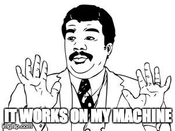

# Telematic Services Web Server
This repository contains the configuration files of the server as well as all the HTML, CSS and JavaScript code needed to run it. It has been written by Carlos Ortega and Pablo Collado. We hope it's nice even though it's definitely not pretty... :smile:

And remember:

  

